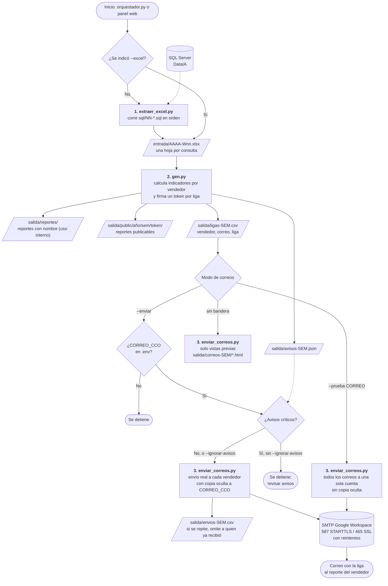
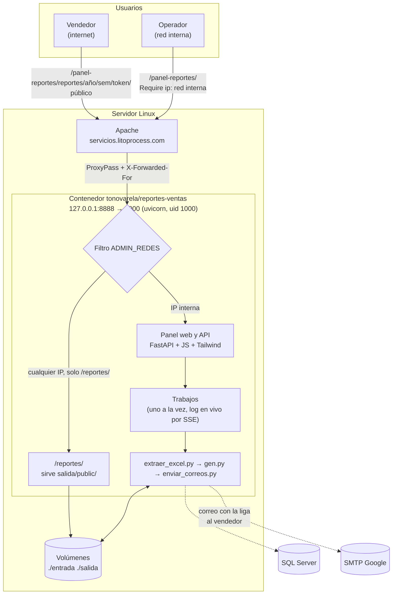

    # Diagrama de flujo

## 1. Proceso semanal

`orquestador.py` corre los tres pasos en orden y se detiene si alguno falla. Desde el panel web se lanza
el mismo proceso, completo o por pasos.

## 2. Despliegue y acceso

